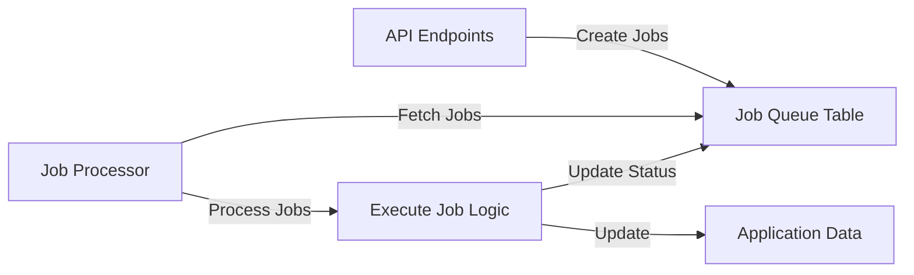

# Design Document

## Overview

This document outlines the design for implementing a job queue system in the A1C Estimator application. The job queue will enable asynchronous processing of computationally intensive tasks such as A1C calculations, report generation, and notifications. The system will be built on top of Supabase, leveraging its database capabilities for job storage and processing.

## Architecture

The job queue system follows a producer-consumer architecture:

1. **Producers**: API endpoints that create jobs in response to user actions or system events
2. **Queue**: Database table that stores job information and status
3. **Consumers**: Background processes that fetch and execute jobs



## Components and Interfaces

### 1. Database Schema

The core of the job queue system is the `job_queue` table in the Supabase database:

```sql
CREATE TABLE job_queue (
  id UUID PRIMARY KEY DEFAULT uuid_generate_v4(),
  job_type VARCHAR NOT NULL,
  payload JSONB NOT NULL,
  status VARCHAR NOT NULL,
  priority INTEGER DEFAULT 0,
  created_at TIMESTAMPTZ DEFAULT NOW(),
  updated_at TIMESTAMPTZ DEFAULT NOW(),
  processed_at TIMESTAMPTZ,
  error TEXT,
  retry_count INTEGER DEFAULT 0,
  next_retry_at TIMESTAMPTZ
);

-- Indexes for efficient querying
CREATE INDEX idx_job_queue_status ON job_queue(status);
CREATE INDEX idx_job_queue_created_at ON job_queue(created_at);
CREATE INDEX idx_job_queue_next_retry_at ON job_queue(next_retry_at);
```

### 2. TypeScript Interfaces

The job system will use TypeScript interfaces to ensure type safety:

```typescript
// Base job interface
export interface Job {
  id?: string;
  job_type: JobType;
  payload: unknown;
  status: JobStatus;
  priority?: number;
  created_at?: string;
  updated_at?: string;
  processed_at?: string | null;
  error?: string | null;
  retry_count?: number;
  next_retry_at?: string | null;
}

// Job status enum
export enum JobStatus {
  PENDING = 'PENDING',
  PROCESSING = 'PROCESSING',
  COMPLETED = 'COMPLETED',
  FAILED = 'FAILED',
  RETRY = 'RETRY',
  DEAD_LETTER = 'DEAD_LETTER'
}

// Job type enum
export enum JobType {
  CALCULATE_A1C = 'CALCULATE_A1C',
  SEND_REMINDER = 'SEND_REMINDER',
  GENERATE_REPORT = 'GENERATE_REPORT',
  CLEANUP_DATA = 'CLEANUP_DATA'
}

// Specific job payload interfaces
export interface CalculateA1CJobPayload {
  user_id: string;
  reading_id: string;
  calculation_type: 'immediate' | 'batch';
}

export interface SendReminderJobPayload {
  user_id: string;
  reminder_type: 'daily' | 'weekly' | 'custom';
  notification_method: 'email' | 'push' | 'in_app';
}

export interface GenerateReportJobPayload {
  user_id: string;
  report_type: 'weekly' | 'monthly' | 'quarterly';
  date_range: {
    start: string;
    end: string;
  };
}

export interface CleanupDataJobPayload {
  cleanup_type: 'archive' | 'delete';
  older_than_days: number;
  tables: string[];
}

// Type-safe job interfaces
export interface CalculateA1CJob extends Job {
  job_type: JobType.CALCULATE_A1C;
  payload: CalculateA1CJobPayload;
}

export interface SendReminderJob extends Job {
  job_type: JobType.SEND_REMINDER;
  payload: SendReminderJobPayload;
}

export interface GenerateReportJob extends Job {
  job_type: JobType.GENERATE_REPORT;
  payload: GenerateReportJobPayload;
}

export interface CleanupDataJob extends Job {
  job_type: JobType.CLEANUP_DATA;
  payload: CleanupDataJobPayload;
}

// Union type for all job types
export type JobUnion = 
  | CalculateA1CJob
  | SendReminderJob
  | GenerateReportJob
  | CleanupDataJob;
```

### 3. Job Management Utilities

The job management utilities will provide functions for creating, updating, and processing jobs:

```typescript
// Job creation
async function createJob<T extends JobUnion>(job: Omit<T, 'id' | 'status' | 'created_at' | 'updated_at'>): Promise<T> {
  // Implementation details
}

// Job status update
async function updateJobStatus(jobId: string, status: JobStatus, error?: string): Promise<void> {
  // Implementation details
}

// Job fetching
async function fetchPendingJobs(limit: number = 10): Promise<JobUnion[]> {
  // Implementation details
}

// Job processing
async function processJob(job: JobUnion): Promise<void> {
  // Implementation details
}

// Retry logic
async function scheduleRetry(job: JobUnion, error: Error): Promise<void> {
  // Implementation details with exponential backoff
}
```

### 4. API Endpoints

The API endpoints will allow interaction with the job queue:

```typescript
// POST /api/jobs
// Create a new job
export async function POST(request: NextRequest) {
  // Implementation details
}

// GET /api/jobs/:id
// Get job status
export async function GET(request: NextRequest, { params }: { params: { id: string } }) {
  // Implementation details
}

// GET /api/jobs
// List jobs with filtering
export async function GET(request: NextRequest) {
  // Implementation details with query parameters for filtering
}
```

### 5. Job Processor

The job processor will be responsible for executing jobs:

```typescript
// Job processor class
class JobProcessor {
  private isRunning: boolean = false;
  private concurrencyLimit: number = 5;
  private activeJobs: Set<string> = new Set();

  // Start processing jobs
  public async start(): Promise<void> {
    // Implementation details
  }

  // Stop processing jobs
  public async stop(): Promise<void> {
    // Implementation details
  }

  // Process a batch of jobs
  private async processBatch(): Promise<void> {
    // Implementation details
  }

  // Execute a specific job
  private async executeJob(job: JobUnion): Promise<void> {
    // Implementation details with job type routing
  }
}
```

### 6. Job Handlers

Each job type will have a specific handler:

```typescript
// Job handler interface
interface JobHandler<T extends JobUnion> {
  execute(job: T): Promise<void>;
}

// A1C calculation job handler
class CalculateA1CJobHandler implements JobHandler<CalculateA1CJob> {
  public async execute(job: CalculateA1CJob): Promise<void> {
    // Implementation details
  }
}

// Other job handlers follow the same pattern
```

## Data Models

The job queue system will interact with the following data models:

1. **Job**: Represents a task to be executed asynchronously
2. **User**: The user associated with the job (for user-specific jobs)
3. **GlucoseReading**: For A1C calculation jobs
4. **A1CEstimate**: For storing calculation results

The relationships between these models are:

- A Job can reference a User through the payload
- A Job can reference GlucoseReadings through the payload
- A Job can create or update A1CEstimates as a result of processing

## Error Handling

The job queue system will implement comprehensive error handling:

1. **Job-level error handling**: Each job execution will be wrapped in try-catch blocks to prevent a single job failure from affecting others
2. **Retry mechanism**: Failed jobs will be retried with exponential backoff
3. **Dead letter queue**: Jobs that fail repeatedly will be moved to a dead letter status for manual inspection
4. **Error logging**: Detailed error information will be stored in the job record and logged for debugging
5. **Monitoring**: Alerts will be triggered for high failure rates or queue backlogs

Retry strategy:

```typescript
async function scheduleRetry(job: JobUnion, error: Error): Promise<void> {
  const retryCount = (job.retry_count || 0) + 1;
  const maxRetries = 3;
  
  if (retryCount <= maxRetries) {
    // Exponential backoff: 1min, 5min, 25min
    const delayMinutes = Math.pow(5, retryCount - 1);
    const nextRetryAt = new Date(Date.now() + delayMinutes * 60 * 1000);
    
    await supabase
      .from('job_queue')
      .update({
        status: JobStatus.RETRY,
        retry_count: retryCount,
        next_retry_at: nextRetryAt.toISOString(),
        error: error.message,
        updated_at: new Date().toISOString()
      })
      .eq('id', job.id);
  } else {
    // Move to dead letter queue after max retries
    await supabase
      .from('job_queue')
      .update({
        status: JobStatus.DEAD_LETTER,
        error: `Max retries exceeded. Last error: ${error.message}`,
        updated_at: new Date().toISOString()
      })
      .eq('id', job.id);
  }
}
```

## Testing Strategy

The job queue system will be tested at multiple levels:

1. **Unit tests**: Test individual components like job handlers and utility functions
2. **Integration tests**: Test the interaction between components
3. **End-to-end tests**: Test the complete flow from job creation to processing

Test cases will include:

- Creating jobs of different types
- Processing jobs successfully
- Handling job failures and retries
- Concurrent job processing
- Edge cases like invalid payloads or database errors

Example test structure:

```typescript
describe('Job Queue System', () => {
  describe('Job Creation', () => {
    it('should create a job with valid parameters', async () => {
      // Test implementation
    });
    
    it('should reject a job with invalid parameters', async () => {
      // Test implementation
    });
  });
  
  describe('Job Processing', () => {
    it('should process a job successfully', async () => {
      // Test implementation
    });
    
    it('should handle job failure and retry', async () => {
      // Test implementation
    });
  });
});
```

## Implementation Considerations

### Performance

To ensure optimal performance:

1. Use database indexes on frequently queried columns
2. Implement job batching for similar operations
3. Use connection pooling for database operations
4. Implement concurrency limits to prevent resource exhaustion
5. Use efficient locking mechanisms to prevent job duplication

### Security

Security considerations include:

1. Validate job payloads to prevent injection attacks
2. Implement proper access control for job management endpoints
3. Sanitize error messages to prevent information leakage
4. Use parameterized queries for database operations
5. Implement rate limiting for job creation endpoints

### Scalability

The design supports scalability through:

1. Horizontal scaling of job processors
2. Database partitioning for large job tables
3. Prioritization of critical jobs
4. Efficient job fetching with skip locked pattern
5. Configurable concurrency limits

## Monitoring and Observability

The job queue system will include monitoring capabilities:

1. **Metrics collection**: Track job creation rate, processing time, success/failure rates
2. **Queue depth monitoring**: Alert on growing backlogs
3. **Error rate monitoring**: Alert on high failure rates
4. **Processing latency**: Track time from job creation to completion
5. **Dashboard**: Visualize job queue health and performance

SQL queries for monitoring:

```sql
-- Job status summary
SELECT 
  job_type,
  status,
  COUNT(*) as count,
  AVG(EXTRACT(EPOCH FROM (processed_at - created_at))) as avg_processing_time_seconds
FROM job_queue 
WHERE created_at > NOW() - INTERVAL '24 hours'
GROUP BY job_type, status;

-- Failed jobs analysis
SELECT 
  job_type,
  error,
  COUNT(*) as failure_count
FROM job_queue 
WHERE status = 'FAILED'
  AND created_at > NOW() - INTERVAL '7 days'
GROUP BY job_type, error
ORDER BY failure_count DESC;
```