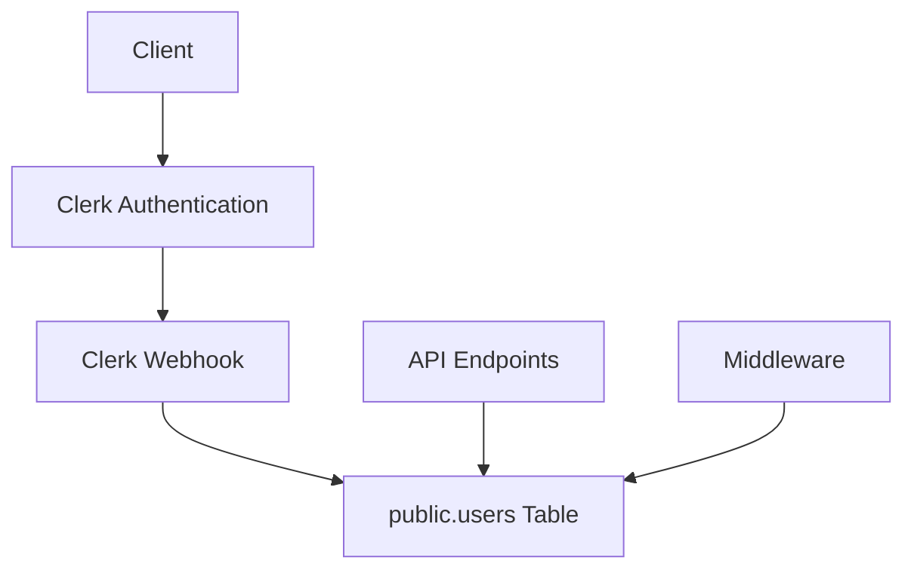
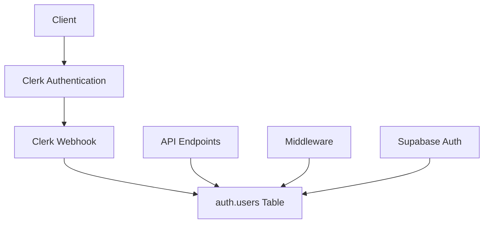

# Design Document: User Authentication Migration

## Overview

This document outlines the design for migrating the user management system from the current `public.users` table to Supabase's built-in `auth.users` table. The migration will involve changes to the database schema, API endpoints, and integration with the existing Clerk authentication system.

## Architecture

The current architecture uses Clerk for authentication and a custom `public.users` table for storing user data. The new architecture will leverage Supabase's built-in authentication system with the `auth.users` table while maintaining Clerk as the authentication provider.

### Current Architecture



### New Architecture



## Components and Interfaces

### 1. Database Schema Changes

#### Current Schema (simplified)

```sql
-- public.users table
CREATE TABLE public.users (
  id UUID PRIMARY KEY,
  email TEXT UNIQUE,
  first_name TEXT,
  last_name TEXT,
  role TEXT,
  metadata JSONB,
  created_at TIMESTAMP WITH TIME ZONE DEFAULT NOW(),
  updated_at TIMESTAMP WITH TIME ZONE DEFAULT NOW()
);
```

#### New Schema (using auth.users)

The `auth.users` table is managed by Supabase and has the following structure:

```sql
-- auth.users table (managed by Supabase)
-- This is a simplified representation
CREATE TABLE auth.users (
  id UUID PRIMARY KEY,
  email TEXT UNIQUE,
  raw_user_meta_data JSONB,
  raw_app_meta_data JSONB,
  created_at TIMESTAMP WITH TIME ZONE,
  updated_at TIMESTAMP WITH TIME ZONE,
  -- other fields managed by Supabase
);
```

We will need to map our custom fields to the appropriate fields in `auth.users`:

| public.users field | auth.users field |
|--------------------|------------------|
| id                 | id               |
| email              | email            |
| first_name         | raw_user_meta_data->>'first_name' |
| last_name          | raw_user_meta_data->>'last_name' |
| role               | raw_app_meta_data->>'role' |
| metadata           | raw_user_meta_data |
| created_at         | created_at |
| updated_at         | updated_at |

### 2. Migration Script

The migration script will:

1. Create a backup of the `public.users` table
2. For each user in `public.users`:
   - Check if the user exists in `auth.users`
   - If yes, update the metadata in `auth.users`
   - If no, create a new user in `auth.users`
3. Update foreign key references in related tables
4. Create views or functions to maintain backward compatibility

### 3. Clerk Webhook Integration

The Clerk webhook integration will be updated to:

1. Receive user events from Clerk
2. Process events using the job queue system
3. Create/update/delete users in `auth.users` instead of `public.users`
4. Handle role mapping and metadata storage in the appropriate fields

### 4. API Endpoints

All API endpoints that interact with user data will be updated to:

1. Query `auth.users` instead of `public.users`
2. Use the appropriate field mappings for user data
3. Handle the different schema structure of `auth.users`

### 5. Authentication Middleware

The authentication middleware will be updated to:

1. Verify user credentials against `auth.users`
2. Extract user roles from `raw_app_meta_data->>'role'`
3. Create sessions with data from `auth.users`

### 6. TypeScript Type Definitions

TypeScript type definitions will be updated to reflect the new schema:

```typescript
// Current User type
interface User {
  id: string;
  email: string;
  first_name: string;
  last_name: string;
  role: string;
  metadata: Record<string, any>;
  created_at: string;
  updated_at: string;
}

// New User type
interface User {
  id: string;
  email: string;
  raw_user_meta_data: {
    first_name: string;
    last_name: string;
    [key: string]: any;
  };
  raw_app_meta_data: {
    role: string;
    [key: string]: any;
  };
  created_at: string;
  updated_at: string;
}
```

## Data Models

### User Model

The user model will be adapted to work with the `auth.users` table:

```typescript
// Helper functions to access user data
export function getUserName(user: User): string {
  return `${user.raw_user_meta_data?.first_name || ''} ${user.raw_user_meta_data?.last_name || ''}`.trim();
}

export function getUserRole(user: User): string {
  return user.raw_app_meta_data?.role || 'user';
}

// User data access functions
export async function getUserById(id: string): Promise<User | null> {
  const { data, error } = await supabase
    .from('auth.users')
    .select('*')
    .eq('id', id)
    .single();
  
  if (error || !data) return null;
  return data;
}
```

### Foreign Key Relationships

Tables with foreign keys to `public.users` will need to be updated:

```sql
-- Example: Update foreign key in glucose_readings table
ALTER TABLE glucose_readings 
  DROP CONSTRAINT glucose_readings_user_id_fkey,
  ADD CONSTRAINT glucose_readings_user_id_fkey 
    FOREIGN KEY (user_id) 
    REFERENCES auth.users(id);
```

## Database Functions, Policies, and Triggers Cleanup

### Current Database Objects

The current implementation uses several database functions, policies, and triggers to handle the clerk_id integration:

#### Functions

```sql
-- Example function that maps clerk_id to user_id
CREATE OR REPLACE FUNCTION public.get_user_id_from_clerk_id(clerk_id text)
RETURNS uuid
LANGUAGE plpgsql
AS $$
DECLARE
  user_id uuid;
BEGIN
  SELECT id INTO user_id FROM public.users WHERE metadata->>'clerk_id' = clerk_id;
  RETURN user_id;
END;
$$;
```

#### Policies

```sql
-- Example policy that uses clerk_id for row-level security
CREATE POLICY "Users can only see their own readings"
  ON public.glucose_readings
  FOR SELECT
  USING (auth.uid() = get_user_id_from_clerk_id(user_id::text));
```

#### Triggers

```sql
-- Example trigger that syncs user data on update
CREATE TRIGGER sync_user_data
  AFTER UPDATE ON public.users
  FOR EACH ROW
  EXECUTE FUNCTION public.sync_user_data();
```

### Cleanup Plan

1. Identify all database objects related to clerk_id handling
2. Create replacements that work with auth.users where needed
3. Update or remove objects that are no longer necessary
4. Test thoroughly before removing any objects

### New Policies

Policies will be simplified to use auth.uid() directly:

```sql
-- Updated policy using auth.uid() directly
CREATE POLICY "Users can only see their own readings"
  ON public.glucose_readings
  FOR SELECT
  USING (auth.uid() = user_id);
```

## Error Handling

### Migration Errors

1. The migration script will log detailed error messages
2. If a user cannot be migrated, the script will record the error and continue
3. A summary of migration errors will be provided at the end

### Runtime Errors

1. API endpoints will handle errors when accessing `auth.users`
2. Appropriate HTTP status codes will be returned for different error scenarios
3. Error messages will be logged for debugging

## Testing Strategy

### Unit Tests

1. Update all unit tests to use `auth.users` instead of `public.users`
2. Test helper functions for accessing user data
3. Test error handling for various scenarios

### Integration Tests

1. Test the Clerk webhook integration with `auth.users`
2. Test API endpoints with the new user schema
3. Test authentication and authorization with `auth.users`

### End-to-End Tests

1. Update E2E tests to work with `auth.users`
2. Test complete user flows from registration to deletion
3. Test role-based access control

## Rollback Plan

### Backup Strategy

1. Create a complete backup of the database before migration
2. Create a specific backup of `public.users` and related tables
3. Store backups in a secure location

### Rollback Procedure

1. If migration fails, restore the `public.users` table from backup
2. Revert code changes that reference `auth.users`
3. Test the system to ensure it works as before

## Supabase Branching Strategy

### Branch Creation

1. Create a new Supabase branch named `user-auth-migration`
2. All database schema changes will be made in this branch
3. The migration script will be tested in this branch

### Development Workflow

1. Develop and test changes in the `user-auth-migration` branch
2. Run the migration script in the branch environment
3. Test all functionality in the branch environment

### Branch Merging

1. Once testing is complete, create a preview of the merge
2. Review the changes and potential impacts
3. Schedule a maintenance window for the merge
4. Merge the branch to production

### Monitoring

1. Monitor system performance during and after the merge
2. Watch for any errors related to user authentication
3. Be prepared to roll back if necessary