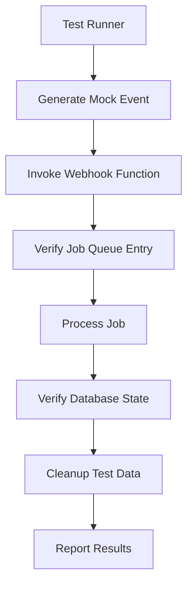

# Design Document: User Sync Webhook Testing with Job Queue Integration

## Overview

This design outlines a comprehensive testing strategy for the Clerk-to-Supabase user synchronization webhook. The webhook is a critical component that ensures user data consistency between our authentication provider (Clerk) and our application database (Supabase). The tests will verify that user creation, updates, and deletion events are properly handled. To improve reliability and scalability, the webhook will use a job queue system for processing events asynchronously.

## Architecture

The testing architecture will consist of:

1. **Test Environment Setup**: Isolated environment with test instances of Clerk and Supabase
2. **Mock Webhook Events**: Generation of webhook payloads that mimic Clerk events
3. **Webhook Invocation**: Direct invocation of the webhook function with mock events
4. **Job Queue Verification**: Checks to ensure events are properly queued
5. **Job Processing**: Processing of queued jobs by the job worker
6. **Database Verification**: Checks to ensure database state matches expected outcomes
7. **Cleanup Routines**: Procedures to remove test data after test execution



## Components and Interfaces

### Test Runner

The test runner will orchestrate the entire test flow and will be implemented using Cypress for E2E testing.

**Interface:**
- `runUserCreationTest()`: Tests user creation flow
- `runUserUpdateTest()`: Tests user update flow
- `runUserDeletionTest()`: Tests user deletion flow
- `runErrorHandlingTest()`: Tests error handling scenarios

### Mock Event Generator

This component will create webhook payloads that mimic Clerk events.

**Interface:**
- `generateUserCreatedEvent(userData)`: Creates a user creation event payload
- `generateUserUpdatedEvent(userId, updatedData)`: Creates a user update event payload
- `generateUserDeletedEvent(userId)`: Creates a user deletion event payload
- `generateMalformedEvent()`: Creates invalid event payloads for error testing

### Webhook Invoker

This component will directly call the webhook function with mock events.

**Interface:**
- `invokeWebhook(eventPayload)`: Sends the event payload to the webhook endpoint
- `getWebhookResponse()`: Retrieves and parses the webhook response

### Job Queue Verifier

This component will check that events are properly added to the job queue.

**Interface:**
- `verifyJobCreated(jobType, payload)`: Checks if a job was created with the correct type and payload
- `getJobDetails(jobId)`: Retrieves details about a specific job
- `waitForJobCompletion(jobId, timeout)`: Waits for a job to complete with timeout

### Database Verifier

This component will check that the database state matches expected outcomes after job processing.

**Interface:**
- `verifyUserExists(userId, expectedData)`: Checks if user exists with correct data
- `verifyUserUpdated(userId, expectedData)`: Checks if user data was updated correctly
- `verifyUserDeleted(userId)`: Checks if user was deleted or deactivated
- `getDatabaseState(userId)`: Retrieves current database state for a user

### Cleanup Utility

This component will remove test data after test execution.

**Interface:**
- `removeTestUser(userId)`: Removes a test user from both Clerk and the database
- `removeAllTestUsers()`: Removes all test users created during testing
- `cleanupTestJobs()`: Removes test jobs from the job queue

## Data Models

### Test User

```typescript
interface TestUser {
  id: string;
  email: string;
  firstName: string;
  lastName: string;
  metadata: Record<string, any>;
  createdAt: Date;
}
```

### Webhook Event

```typescript
interface WebhookEvent {
  type: 'user.created' | 'user.updated' | 'user.deleted';
  data: {
    id: string;
    email_addresses: Array<{
      email_address: string;
      verification: {
        status: string;
      };
    }>;
    first_name: string;
    last_name: string;
    public_metadata: Record<string, any>;
    created_at: number;
  };
}
```

### Job Queue Entry

```typescript
interface JobQueueEntry {
  id: string;
  job_type: 'USER_CREATED' | 'USER_UPDATED' | 'USER_DELETED';
  payload: Record<string, any>;
  status: 'PENDING' | 'PROCESSING' | 'COMPLETED' | 'FAILED';
  created_at: Date;
  updated_at: Date;
  processed_at?: Date;
  error?: string;
  retry_count: number;
}
```

### Test Result

```typescript
interface TestResult {
  success: boolean;
  message: string;
  details?: {
    expected: any;
    actual: any;
    diff?: any;
  };
}
```

## Job Queue Integration

The webhook will be modified to use the job queue system for processing events:

1. **Webhook Receives Event**: The webhook endpoint receives a Clerk event
2. **Event Validation**: The webhook validates the event structure and signature
3. **Job Creation**: The webhook creates a job in the job queue with appropriate type and payload
4. **Immediate Response**: The webhook returns a success response after the job is created
5. **Asynchronous Processing**: The job queue worker processes the job asynchronously
6. **Database Operations**: The job handler performs the necessary database operations
7. **Job Completion**: The job is marked as completed or failed based on the outcome

### Job Types

- `USER_CREATED`: Job for processing user creation events
- `USER_UPDATED`: Job for processing user update events
- `USER_DELETED`: Job for processing user deletion events

### Error Handling and Retries

The job queue system will handle errors and retries:

1. **Transient Errors**: Jobs that fail due to transient errors will be retried with exponential backoff
2. **Permanent Failures**: Jobs that fail repeatedly will be marked as permanently failed
3. **Error Logging**: Detailed error information will be logged for debugging
4. **Manual Intervention**: A mechanism will be provided for manually resolving failed jobs

## Error Handling

The testing framework will handle the following error scenarios:

1. **Webhook Invocation Failures**: If the webhook cannot be invoked, tests will fail with clear error messages about connectivity issues.

2. **Job Queue Failures**: If jobs cannot be added to the queue, tests will provide detailed error information.

3. **Job Processing Failures**: If jobs fail during processing, tests will check error handling and retry mechanisms.

4. **Verification Failures**: If database state doesn't match expectations, detailed diffs will be provided showing expected vs. actual state.

5. **Cleanup Failures**: If test data cannot be removed, warnings will be logged and subsequent test runs will be designed to handle orphaned test data.

6. **Timeout Handling**: Tests will include appropriate timeouts for webhook processing, job execution, and database operations, with clear error messages when timeouts occur.

## Testing Strategy

### Unit Tests

Unit tests will focus on the webhook function's internal logic and job handlers:

1. **Event Parsing**: Test that different event types are correctly parsed
2. **Job Creation**: Test that jobs are correctly created with appropriate types and payloads
3. **Job Handlers**: Test that job handlers correctly process different job types
4. **Error Handling**: Test that errors are properly caught and handled

### Integration Tests

Integration tests will verify the webhook's interaction with the job queue and database:

1. **Webhook to Queue**: Test that events received by the webhook are properly added to the job queue
2. **Queue to Database**: Test that jobs are properly processed and result in correct database operations
3. **Transaction Handling**: Test that database operations are properly committed or rolled back
4. **Data Integrity**: Test that data is correctly transformed between Clerk and database formats

### End-to-End Tests

E2E tests will verify the entire flow from Clerk event to database state:

1. **User Creation Flow**: Test complete flow from Clerk user creation event to database record creation
2. **User Update Flow**: Test that updates in Clerk propagate to the database
3. **User Deletion Flow**: Test that user deletion in Clerk results in appropriate database actions
4. **Error Recovery**: Test that the system recovers from temporary failures
5. **Concurrent Events**: Test handling of multiple events arriving in quick succession

### Performance Tests

Basic performance tests will ensure the webhook and job queue meet performance requirements:

1. **Webhook Response Time**: Test that the webhook responds quickly after queueing jobs
2. **Job Processing Time**: Test that jobs are processed within acceptable time limits
3. **Queue Throughput**: Test the system's ability to handle a high volume of events