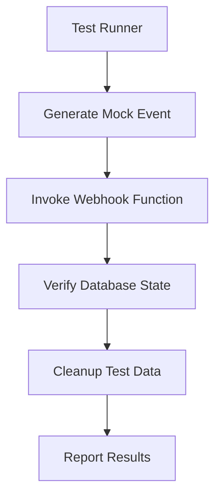

# Design Document: User Sync Webhook Testing

## Overview

This design outlines a comprehensive testing strategy for the Clerk-to-Supabase user synchronization webhook. The webhook is a critical component that ensures user data consistency between our authentication provider (Clerk) and our application database (Supabase). The tests will verify that user creation, updates, and deletion events are properly handled.

## Architecture

The testing architecture will consist of:

1. **Test Environment Setup**: Isolated environment with test instances of Clerk and Supabase
2. **Mock Webhook Events**: Generation of webhook payloads that mimic Clerk events
3. **Webhook Invocation**: Direct invocation of the webhook function with mock events
4. **Verification Layer**: Checks to ensure database state matches expected outcomes
5. **Cleanup Routines**: Procedures to remove test data after test execution



## Components and Interfaces

### Test Runner

The test runner will orchestrate the entire test flow and will be implemented using Cypress for E2E testing.

**Interface:**
- `runUserCreationTest()`: Tests user creation flow
- `runUserUpdateTest()`: Tests user update flow
- `runUserDeletionTest()`: Tests user deletion flow
- `runErrorHandlingTest()`: Tests error handling scenarios

### Mock Event Generator

This component will create webhook payloads that mimic Clerk events.

**Interface:**
- `generateUserCreatedEvent(userData)`: Creates a user creation event payload
- `generateUserUpdatedEvent(userId, updatedData)`: Creates a user update event payload
- `generateUserDeletedEvent(userId)`: Creates a user deletion event payload
- `generateMalformedEvent()`: Creates invalid event payloads for error testing

### Webhook Invoker

This component will directly call the webhook function with mock events.

**Interface:**
- `invokeWebhook(eventPayload)`: Sends the event payload to the webhook endpoint
- `getWebhookResponse()`: Retrieves and parses the webhook response

### Database Verifier

This component will check that the database state matches expected outcomes after webhook execution.

**Interface:**
- `verifyUserExists(userId, expectedData)`: Checks if user exists with correct data
- `verifyUserUpdated(userId, expectedData)`: Checks if user data was updated correctly
- `verifyUserDeleted(userId)`: Checks if user was deleted or deactivated
- `getDatabaseState(userId)`: Retrieves current database state for a user

### Cleanup Utility

This component will remove test data after test execution.

**Interface:**
- `removeTestUser(userId)`: Removes a test user from both Clerk and the database
- `removeAllTestUsers()`: Removes all test users created during testing

## Data Models

### Test User

```typescript
interface TestUser {
  id: string;
  email: string;
  firstName: string;
  lastName: string;
  metadata: Record<string, any>;
  createdAt: Date;
}
```

### Webhook Event

```typescript
interface WebhookEvent {
  type: 'user.created' | 'user.updated' | 'user.deleted';
  data: {
    id: string;
    email_addresses: Array<{
      email_address: string;
      verification: {
        status: string;
      };
    }>;
    first_name: string;
    last_name: string;
    public_metadata: Record<string, any>;
    created_at: number;
  };
}
```

### Test Result

```typescript
interface TestResult {
  success: boolean;
  message: string;
  details?: {
    expected: any;
    actual: any;
    diff?: any;
  };
}
```

## Error Handling

The testing framework will handle the following error scenarios:

1. **Webhook Invocation Failures**: If the webhook cannot be invoked, tests will fail with clear error messages about connectivity issues.

2. **Verification Failures**: If database state doesn't match expectations, detailed diffs will be provided showing expected vs. actual state.

3. **Cleanup Failures**: If test data cannot be removed, warnings will be logged and subsequent test runs will be designed to handle orphaned test data.

4. **Timeout Handling**: Tests will include appropriate timeouts for webhook processing and database operations, with clear error messages when timeouts occur.

## Testing Strategy

### Unit Tests

Unit tests will focus on the webhook function's internal logic:

1. **Event Parsing**: Test that different event types are correctly parsed
2. **Database Operations**: Test database create/update/delete operations with mocked database clients
3. **Error Handling**: Test that errors are properly caught and handled

### Integration Tests

Integration tests will verify the webhook's interaction with the database:

1. **Database Connectivity**: Test that the webhook can connect to the database
2. **Transaction Handling**: Test that database operations are properly committed or rolled back
3. **Data Integrity**: Test that data is correctly transformed between Clerk and database formats

### End-to-End Tests

E2E tests will verify the entire flow from Clerk event to database state:

1. **User Creation Flow**: Test complete flow from Clerk user creation to database record creation
2. **User Update Flow**: Test that updates in Clerk propagate to the database
3. **User Deletion Flow**: Test that user deletion in Clerk results in appropriate database actions
4. **Error Recovery**: Test that the system recovers from temporary failures

### Performance Tests

Basic performance tests will ensure the webhook meets performance requirements:

1. **Response Time**: Test that the webhook responds within acceptable time limits
2. **Concurrent Events**: Test handling of multiple events arriving in quick succession